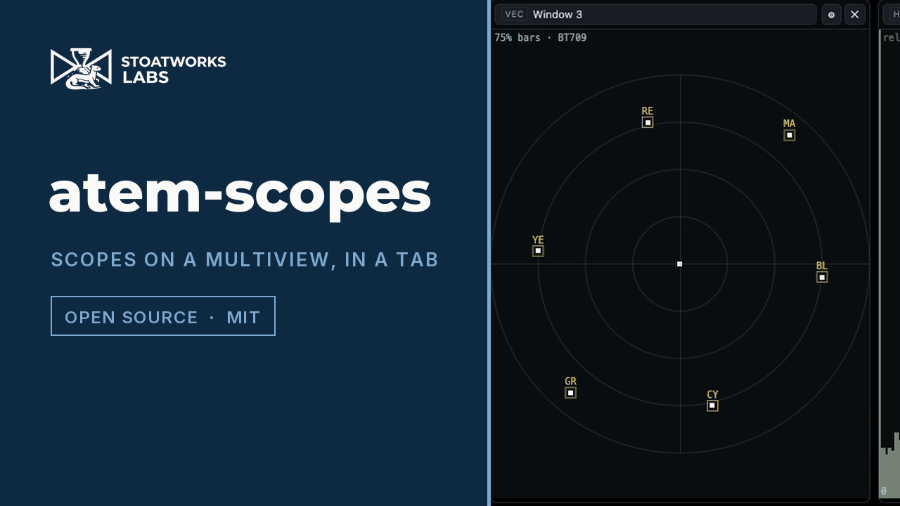

# atem-scopes

> **AI-assisted project.** This codebase was created with [Claude Code](https://claude.com/claude-code)
> (Anthropic), directed and reviewed by a human author. The scope engine is verified against a
> built-in test pattern (see [Verification](#verification)); it has **not** been used with a real
> ATEM switcher, a real multiview capture, or a DeckLink card.

Video scopes arranged around a live ATEM multiview. Capture the switcher's multiview output over
USB, draw a region round each window, and put a waveform, vectorscope, histogram, false colour,
zebras or focus peaking on any of them — including program and preview.

Sources are named from the switcher's own multiviewer configuration, live, so re-routing a
multiview window mid-show relabels the scope watching it without touching the geometry.

## Two builds, one codebase

|                                     | Desktop (Electron)     | Hosted (Cloudflare Worker) |
| ----------------------------------- | ---------------------- | -------------------------- |
| UVC capture + every scope           | ✅                     | ✅                         |
| Region drawing and naming           | ✅                     | ✅                         |
| Live source names from the switcher | ✅                     | ❌                         |
| DeckLink capture                    | ⚠️ unbuilt — see below | ❌                         |

The hosted build's two gaps are properties of the browser, not features left undone:

- **The ATEM control protocol is UDP on port 9910.** A page has no UDP API. WebRTC and
  WebTransport are negotiated transports; neither can talk to a switcher that has never heard of
  them. simpleVIS documents the identical wall for Art-Net and sACN.
- **A DeckLink card is reached through Blackmagic's SDK against a kernel driver.** It does not
  enumerate as a webcam, so `getUserMedia` cannot see it. Blackmagic's _boxes_ — UltraStudio
  Recorder 3G, the Web Presenter family — deliberately do present as UVC, and those work in the
  browser like any other camera. The PCIe cards do not.

So the hosted build names regions from what you type when you draw them, and the desktop build
prefers the switcher's answer. Same screen, same workflow.

Components branch on `window.api.capabilities` and hide what the current target cannot do rather
than offering a button that always fails. The backend is chosen at _build_ time, so the hosted
bundle contains no switcher code at all — verifiably: `grep 9910 dist/assets/*.js` finds nothing.

## The thing this app is careful about

**We never see the video signal. We see whatever RGB the capture path handed the browser**, and
that path has already made two decisions it does not report:

1. which matrix it used to get from Y'CbCr to RGB (BT.601 or BT.709), and
2. whether it expanded studio-range levels (16–235) to full range.

Get either wrong and the scopes are _plausibly_ wrong rather than obviously wrong. A BT.709 signal
read as BT.601 throws every vectorscope target 5.74° off its box; unexpanded studio levels put
reference white at 92 IRE. Both look like a mildly misadjusted camera.

There is no way to detect this from the pixels, so it is an explicit setting the UI states, not a
guess. See [`src/shared/colorimetry.ts`](src/shared/colorimetry.ts).

Two related honesty points the UI surfaces per tile:

- **A multiview tile is a monitoring aid, not a measurement.** It is a few hundred pixels wide,
  compressed over USB, and often has a label bar, tally border or audio meter burnt into it. The
  window inset exists to keep those out of the trace, and a tile whose window the switcher reports
  an overlay on is badged `overlay in crop`.
- **Seeded geometry is badged `uncalibrated`** until a human has looked at it.

For an honest measurement, capture an aux out whole as a second device and scope that.

## Verification

The app generates its own 75% colour bars (`Start test pattern`), for the same reason simpleRTA
generates its own pink noise: it is the only way to check the instrument without trusting the thing
you are measuring. It is self-validating — the vectorscope graticule is computed from the same
matrix the shader plots with, so with 75% bars the trace _must_ land in the boxes.

Measured by reading pixels back off the GL canvas, BT.709, full range:

| 75% bar | Expected IRE | Waveform read |
| ------- | ------------ | ------------- |
| Blue    | 5.42         | 5.4           |
| Red     | 15.95        | 15.8          |
| Magenta | 21.36        | 21.2          |
| Green   | 53.64        | 53.4          |
| Cyan    | 59.06        | 58.8          |
| Yellow  | 69.59        | 69.4          |
| White   | 75.00        | 74.8          |

Differences are the row quantisation of the readback. The vectorscope trace landed on its cyan,
green and blue 75% targets to within a pixel.

**What that does and does not prove.** It proves the maths, the shader uniforms, the graticule
derivation and the full capture→texture→scope path agree end to end. It proves nothing about a real
ATEM: no switcher has ever been connected, no multiview has been captured, and the mapping from
multiview window index to screen position is an assumption the calibration screen exists to correct.

## DeckLink

The native addon in [`native/decklink`](native/decklink) **has never been compiled or run.** The
Blackmagic SDK is a free but licence-gated download and is not ours to redistribute, so it is not
vendored and was not available where this was written. It builds only with `DECKLINK_SDK_DIR` set,
and the app is fully functional without it — `capabilities.decklinkCapture` is false and the UI
hides DeckLink entirely.

It captures native UYVY rather than letting the card convert to BGRA, deliberately: the driver does
not report which matrix it used, and RGB cannot be un-converted. See
[`native/decklink/README.md`](native/decklink/README.md).

## Video

[](https://www.youtube.com/watch?v=ZABAnwzS8T0)

A 57-second look at it working, filmed at the hosted address and driven through the app's
own controls. The picture being measured is the built-in colour-bar generator, so every
scope in it can be checked against a signal whose right answer is known — including the
beat where the levels are set wrong on purpose and black falls below zero.

## Download

<!-- downloads:start -->

## Download

**[v0.1.0](https://github.com/stoatworks-labs/atem-scopes/releases/tag/v0.1.0)** — prebuilt for macOS, Windows and Linux. Pick your platform:

<details>
<summary><b>macOS</b> — Apple Silicon, Intel</summary>

| Build | Download | Size |
| --- | --- | --- |
| Apple Silicon · .dmg disk image | [`atem-scopes-0.1.0-arm64.dmg`](https://github.com/stoatworks-labs/atem-scopes/releases/download/v0.1.0/atem-scopes-0.1.0-arm64.dmg) | 116 MB |
| Intel · .dmg disk image | [`atem-scopes-0.1.0.dmg`](https://github.com/stoatworks-labs/atem-scopes/releases/download/v0.1.0/atem-scopes-0.1.0.dmg) | 122 MB |
| Apple Silicon · .pkg installer | [`atem-scopes-0.1.0-macos-arm64.pkg`](https://github.com/stoatworks-labs/atem-scopes/releases/download/v0.1.0/atem-scopes-0.1.0-macos-arm64.pkg) | 117 MB |
| Intel · .pkg installer | [`atem-scopes-0.1.0-macos-x64.pkg`](https://github.com/stoatworks-labs/atem-scopes/releases/download/v0.1.0/atem-scopes-0.1.0-macos-x64.pkg) | 122 MB |

</details>

<details>
<summary><b>Windows</b></summary>

| Build | Download | Size |
| --- | --- | --- |
| .exe installer | [`atem-scopes.Setup.0.1.0.exe`](https://github.com/stoatworks-labs/atem-scopes/releases/download/v0.1.0/atem-scopes.Setup.0.1.0.exe) | 102 MB |

</details>

<details>
<summary><b>Linux</b></summary>

| Build | Download | Size |
| --- | --- | --- |
| AppImage | [`atem-scopes-0.1.0.AppImage`](https://github.com/stoatworks-labs/atem-scopes/releases/download/v0.1.0/atem-scopes-0.1.0.AppImage) | 122 MB |

</details>

Also in this release:

- [`atem-scopes-web.zip`](https://github.com/stoatworks-labs/atem-scopes/releases/latest/download/atem-scopes-web.zip) — Source tarball, 84 KB

All builds, checksums and release notes: [github.com/stoatworks-labs/atem-scopes/releases](https://github.com/stoatworks-labs/atem-scopes/releases).

<!-- downloads:end -->

macOS installers are **Developer ID-signed and notarised by Apple**, nested helper
binaries included, so they open normally. Windows installers are unsigned and
SmartScreen warns once: **More info** → **Run anyway**.

The hosted build needs no install: it runs in any browser with WebGL2.

## Commands

```bash
npm run dev              # Electron dev
npm run preview:static   # the hosted build, in a browser — no Electron needed
npm run static:build     # hosted production build -> dist/
npm run deploy           # static:build + wrangler deploy
npm run typecheck        # node + web — run this, not a bare tsc
npm test                 # vitest
npm run build            # typecheck + electron-vite build
npm run build:mac        # / :win / :linux
```

## Where this sits among the ATEM projects

| Repo                   | Purpose                                                               |
| ---------------------- | --------------------------------------------------------------------- |
| **atem-scopes** (this) | _Measure_ what a switcher is putting out                              |
| **animATEM**           | _Control one_ switcher; UVC multiview compositing for SuperSource/DVE |
| **atem-overseer**      | _Monitor and control_ a fleet from one dashboard                      |
| **atem-fleet-admin**   | _Provision/configure_ many switchers at once                          |

atem-scopes never sends a command to a switcher. It connects, reads the multiviewer window
assignments and input names, and disconnects.

## Licence

MIT — see [LICENSE](LICENSE).
